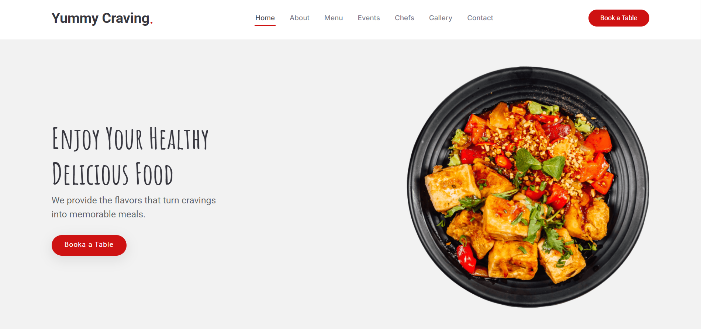
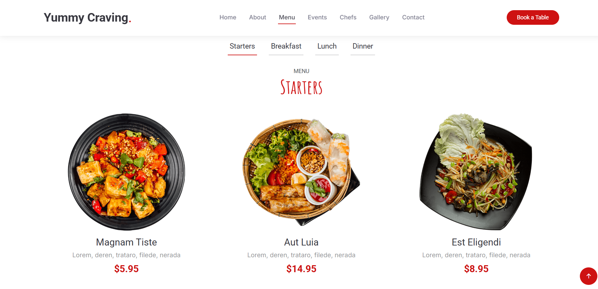

# Yummy Craving - Food Website

**Yummy Craving** is a visually engaging food website built to provide culinary inspiration and delicious recipes. It is designed to be responsive and user-friendly, making it easy to explore and enjoy food content from any device.

## Website Demo

Click on the image below to watch a demo of the website.

[]

[]

---

## Tech Stack

This project was built using the following technologies:

- **HTML**: The basic structure of the website.
- **CSS**: Styling for the layout and design.
- **Bootstrap**: A responsive design framework to make the site mobile-friendly.
- **JavaScript**: Adds interactivity and dynamic behavior to the site.
- **Font Awesome**: For beautiful icons.
- **AOS (Animate On Scroll)**: For smooth animations when scrolling.

## Features

- **Responsive Layout**: Works across all devices.
- **User-Friendly Navigation**: Simple and intuitive navigation across the site.
- **Interactive Elements**: Buttons and hover effects powered by JavaScript.
- **Clean Design**: A minimalistic approach to layout with a focus on user experience.

## How to Run

1. Clone the repository.
2. Open `index.html` in your browser to see the website in action.
3. To view the demo video, click on the image above.

